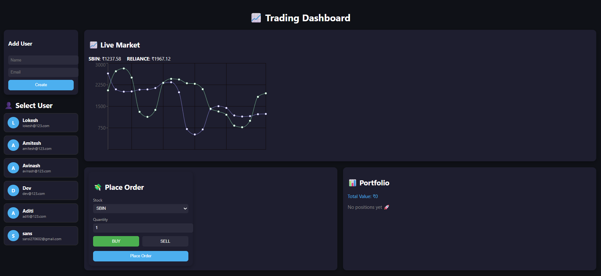
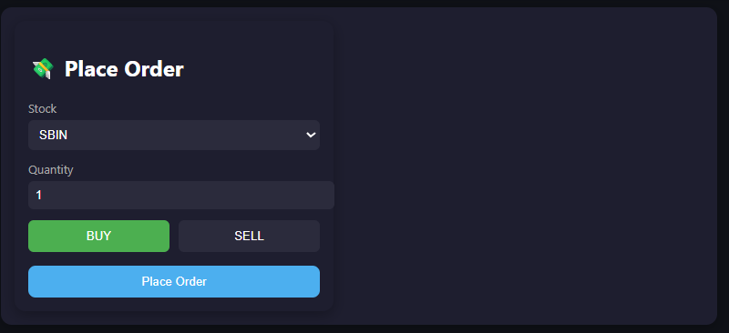
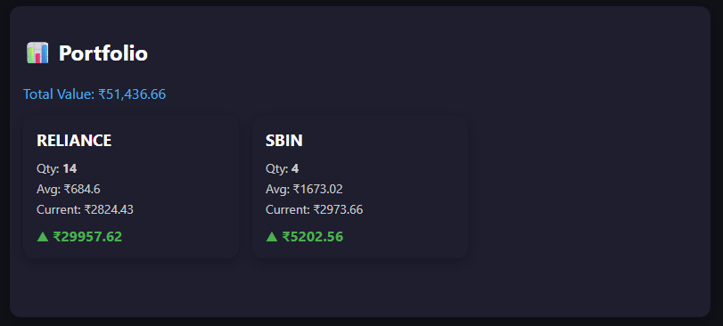
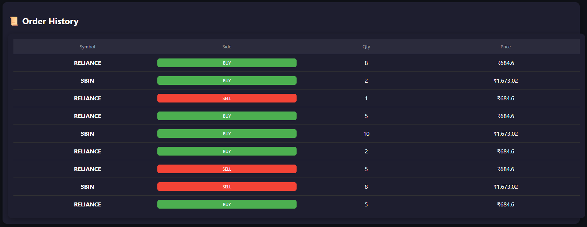

# 📈 Trading Dashboard System

A full-stack trading simulation platform with real-time price updates, order execution, and portfolio tracking.

---

# 🚀 Features

* 👤 User Management (Create & Select Users)
* 💸 Buy / Sell Orders
* 📊 Real-time Portfolio Tracking
* 📜 Order History
* ⚡ Live Price Updates using WebSockets
* 🧠 Backend-driven trading logic
* 🗄️ MySQL Database
* 🔄 Redis for live price simulation

---

# 🏗️ Architecture

```
Frontend (React)
    ↓
FastAPI Backend (Business Logic)
    ↓
MySQL (Persistent Data)
    ↓
Redis (Live Price Store)
    ↓
WebSocket (Real-time Updates)
```

---

# ⚙️ Setup Instructions

## 1️⃣ Clone Repository

```bash
git clone <your-repo-url>
cd trading-dashboard
```

---

## 2️⃣ Backend Setup (FastAPI)

```bash
python -m venv venv
venv\Scripts\activate
pip install -r requirements.txt
```

---

## 3️⃣ Database Setup (MySQL)

```sql
CREATE DATABASE trading_db;
```

Update `database.py`:

```python
from sqlalchemy.engine import URL

DATABASE_URL = URL.create(
    "mysql+pymysql",
    username="root",
    password="your_password",
    host="localhost",
    port=3306,
    database="trading_db"
)
```

---

## 4️⃣ Run Backend

```bash
uvicorn main:app --reload
```

API Docs: http://127.0.0.1:8000/docs

---

## 5️⃣ Run Redis

```bash
redis-server
python price.py
```

---

## 6️⃣ Frontend Setup

```bash
cd frontend
npm install
npm start
```

---

# 🔌 API Documentation

---

## 👤 Users

### ➤ Create User

**POST** `/users`

#### Request

```json
{
  "name": "Lokesh",
  "email": "lokesh@example.com"
}
```

#### Response

```json
{
  "id": 1,
  "name": "Lokesh",
  "email": "lokesh@example.com"
}
```

---

### ➤ Get All Users

**GET** `/users`

#### Response

```json
[
  {
    "id": 1,
    "name": "Lokesh",
    "email": "lokesh@example.com"
  }
]
```

---

## 💸 Orders

### ➤ Place Order

**POST** `/orders`

#### Request

```json
{
  "user_id": 1,
  "symbol": "SBIN",
  "qty": 10,
  "side": "BUY"
}
```

#### Response

```json
{
  "message": "Order executed",
  "price": 820.5,
  "qty": 10,
  "side": "BUY"
}
```

#### Notes

* BUY → deducts balance & updates position
* SELL → adds balance & reduces position

---

### ➤ Get Orders

**GET** `/orders/{user_id}`

#### Example

```
GET /orders/1
```

#### Response

```json
[
  {
    "id": 1,
    "symbol": "SBIN",
    "qty": 10,
    "side": "BUY",
    "price": 820,
    "status": "COMPLETED",
    "created_at": "2026-04-20T10:30:00"
  }
]
```

---

## 📊 Portfolio

### ➤ Get Portfolio

**GET** `/portfolio/{user_id}`

#### Example

```
GET /portfolio/1
```

#### Response

```json
{
  "portfolio": [
    {
      "symbol": "SBIN",
      "quantity": 10,
      "avg_price": 800,
      "current_price": 820,
      "pnl": 200
    }
  ],
  "total_value": 8200
}
```

#### Notes

* Prices fetched from Redis
* PnL updates dynamically

---

## ⚡ WebSocket

### ➤ Connect

```
ws://127.0.0.1:8000/ws/{user_id}
```

---

### ➤ Events

#### 📈 Price Update

```json
{
  "event": "price_update",
  "data": {
    "SBIN": 820.5,
    "RELIANCE": 2500
  }
}
```

---

#### ⚡ Order Executed

```json
{
  "event": "order_executed",
  "symbol": "SBIN",
  "qty": 10,
  "price": 820,
  "side": "BUY",
  "status": "COMPLETED"
}
```

---

# 🔄 Data Flow

### 🟢 Order Flow

```
User → Place Order → Backend
        ↓
Validate → Execute → Store in DB
        ↓
WebSocket Event → Frontend Update
```

---

### 📈 Price Flow

```
Price Generator → Redis
        ↓
Backend fetches price
        ↓
WebSocket broadcast
        ↓
Frontend updates UI
```

---

#  Common Errors

| Error    | Cause                | Fix               |
| -------- | -------------------- | ----------------- |
| 422      | Invalid request body | Check JSON        |
| 400      | Invalid order        | Check balance/qty |
| DB Error | Wrong credentials    | Fix DATABASE_URL  |

---

#  Tech Stack

* React (Frontend)
* FastAPI (Backend)
* MySQL (Database)
* Redis (Cache)
* SQLAlchemy (ORM)
* WebSocket (Realtime)


## Dashboard



---

##  Order Panel



---

##  Portfolio



##  Order history




